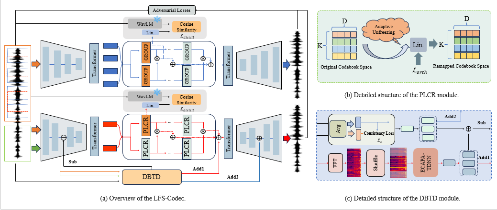

# LFS-Codec

LFS-Codec 是一个高保真神经音频编解码器（Neural Audio Codec）的 PyTorch 实现。该项目基于 Mimi 和 Encodec 的架构设计，利用 SEANet 编码器/解码器、残差矢量量化（RVQ）以及对抗生成网络（GAN）技术，旨在实现低比特率下的高质量音频压缩与重构。

## ✨ 主要特性

* **先进的模型架构**：基于 SEANet Encoder/Decoder 和 Transformer 模块。
* **残差矢量量化 (RVQ)**：支持多码本量化，在压缩率和质量之间取得平衡。
* **对抗训练 & 蒸馏**：集成多尺度 STFT 判别器（Multi-Scale STFT Discriminator）和特征蒸馏损失（WavLM/Wav2Vec），优化听感质量。
* **分布式训练**：支持多 GPU 数据并行（DDP）训练。
* **高效数据加载**：支持 LMDB 格式的大规模音频数据集读取。
* **配置灵活**：使用 Hydra 管理所有训练参数。

## 📂 目录结构

```text
.
├── config/             # 训练配置文件 (config.yaml)
├── models/             # 模型定义 (Mimi, Compression, Quantizer 等)
├── modules/            # 基础网络模块 (SEANet, Transformer, Conv 等)
├── quantization/       # 量化相关实现
├── utils/              # 工具函数
├── compress.py         # 压缩与解压核心 API
├── customAudioDataset.py # LMDB 数据集加载器
├── main.py             # 命令行工具 (CLI)
├── train_multi_gpu.py  # 训练主脚本
├── example.py          # 推理调用示例
└── run.sh              # 启动训练脚本
