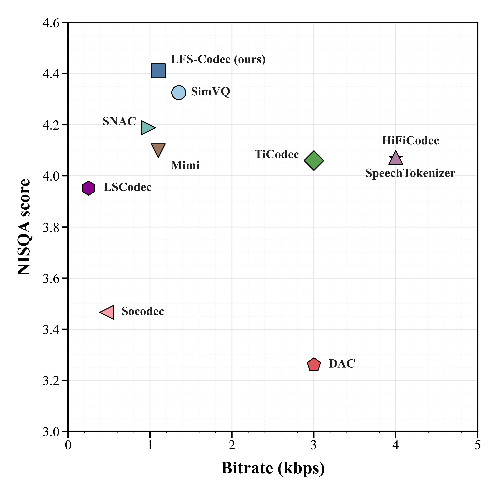

\

# **LFS-Codec: Low-Frame-Rate Speech Coding with Regularized Codebook Remapping and Dual-Branch Timbre Decoupling**

**\[ICME Submission\]**

**Achieving High-Fidelity Speech Reconstruction at Ultralow 12.5 fps**

\</div\>

## **📖 Introduction**

**LFS-Codec** is a low-frame-rate (LFR) neural speech codec designed for resource-constrained multimedia applications. Addressing the common issues of **codebook underutilization** and **loss of timbral details** in conventional models when reducing frame rates, we propose two orthogonal enhancement mechanisms. These innovations allow LFS-Codec to achieve superior reconstruction quality, intelligibility, and speaker similarity at an ultralow frame rate of **12.5 fps**.

### **✨ Key Features**

* **⚡ Extremely Efficient**: Requires only **84 GMACs**, making it suitable for deployment on edge devices.  
* **🎯 PLCR (Parametric Linear Codebook Remapping)**: Maximizes codebook utilization and refines semantic distillation through parametric linear remapping and a dynamic unfreezing strategy.  
* **🎭 DBTD (Dual-Branch Timbre Decoupling)**: A dual-branch module using ECAPA-TDNN and TIRE to extract voice fingerprints and prosody respectively, effectively disentangling content from timbre.

## **🏗️ Architecture Overview**

  

LFS-Codec is built upon the Mimi codec architecture, comprising a causal SeaNet encoder and a transposed convolutional decoder.

1. **Encoder Side**: Incorporates the DBTD module to explicitly subtract timbre features, forcing the VQ bottleneck to focus on linguistic content.  
2. **Quantizer**: Adopts the PLCR strategy, applying strong semantic distillation only to the first RVQ layer.  
3. **Decoder Side**: Re-injects timbre features to restore high-quality speech waveforms.

## **📊 Performance**

  

We conducted extensive evaluations on the **LibriTTS** (English) and **AISHELL-3** (Mandarin) datasets. LFS-Codec significantly outperforms existing adapted High-Frame-Rate (HFR) models and native Low-Frame-Rate (LFR) models at 12.5 fps.

| Model                       | Frame Rate (fps) | GMACs   | NISQA (Quality) ↑ | SIM (Similarity) ↑ | WER (Intelligibility) ↓ |
| :-------------------------- | :--------------- | :------ | :---------------- | :----------------- | :---------------------- |
| **HFR Baselines (Adapted)** |                                                                                               |
| SimVQ                       | 12.5             | 12G     | 1.459             | 0.368              | 72.75%                  |
| DAC                         | 12.5             | 172G    | 2.955             | 0.478              | 19.36%                  |
| **LFR Baselines**           |                                                                                               |
| Mimi \[11\]                 | 12.5             | 69G     | 4.098             | 0.694              | 4.66%                   |
| SNAC \[9\]                  | 47               | 112G    | 4.189             | 0.727              | 4.61%                   |
| **LFS-Codec (Ours)**        | **12.5**         | **84G** | **4.411**         | **0.742**          | **3.95%**               |

**Note**: For more detailed ablation study results (verifying the effectiveness of PLCR and DBTD), please refer to Table II in the paper.

## **🛠️ Installation**

We recommend using Anaconda to create an isolated virtual environment:

\# 1\. Clone the repository  
git clone \[https://github.com/your\_username/LFS-Codec.git\](https://github.com/your\_username/LFS-Codec.git)  
cd LFS-Codec

\# 2\. Create environment  
conda create \-n lfscodec python=3.9  
conda activate lfscodec

\# 3\. Install dependencies (Adjust PyTorch command based on your CUDA version)  
pip install torch torchvision torchaudio \--index-url \[https://download.pytorch.org/whl/cu118\](https://download.pytorch.org/whl/cu118)  
pip install \-r requirements.txt

## **🚀 Quick Start**

### **1\. Data Preparation**

This project uses LibriTTS and AISHELL-3 datasets for training.

### **2\. Training**

Modify the path configurations in configs/lfs\_12.5fps.json, then start training:

python train_multi_gpu.py

**Tip**: The dynamic unfreezing strategy for PLCR will trigger automatically at step 30k without manual intervention.

### **3\. Inference & Reconstruction**

Use a pre-trained model to encode and decode audio for reconstruction:

python example.py \\  
    \--checkpoint checkpoints/lfs\_experiment\_v1/best\_model.pth \\  
    \--input\_file assets/demo\_input.wav \\  
    \--output\_dir results/

## **📄 License**

This project is licensed under the [MIT License](https://www.google.com/search?q=LICENSE).
